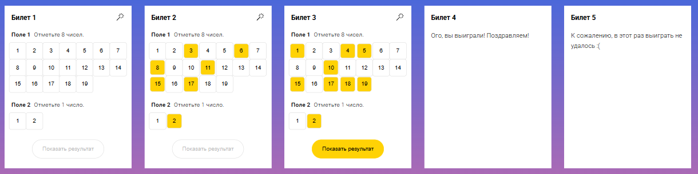

# Lotto game

Choose correct amount of numbers in the fields and try your luck!

## Table of Contents

1. [Game UI](#game-ui)
2. [How to locally run the game](#how-to-locally-run-the-game)
3. [Technical task](#technical-task)
4. [Comments to the solution](#comments-to-the-solution)

## Game UI



## How to locally run the game

#### 0. Prerequisities:

- If you don't have `Node.js` on your PC, install it [here](https://nodejs.org/en/download) (use version **20.18.0** or above)

- Verify `node` version

```bash
node -v // Should print "v20.18.0" or above.
```

- Verify `npm` version

```bash
npm -v // Should print "10.9.0" or above.
```

#### 1. Clone game repository:

```bash
git clone https://github.com/PikuzaMarie/lotto-game.git
```

#### 2. Go to the directory:

```bash
cd lotto-game
```

#### 3. Install dependencies:

```bash
npm install
```

#### 4. Start the app

it will automatically run in your default browser at http://localhost:3000/

```bash
npm run dev
```

### Run tests

```bash
npm run test
```

## Technical task

- Implement the game rules logic. The rules are described in the `docs` —
  check them out here [link](docs/games/8_out_of_19.md)
- Clean, well-structured code with linters (`ESLint`) integration is encouraged
- Use any preferred version of React for development. `Create React App` can be used for quick initial project setup
- Mobile-first responsive design, approximated to [mockup](https://www.figma.com/file/VDraSBJhGzDKP33eS4IBbp6Z/Finch_test)
- Implement the random field generation logic according to the lottery rules when the magic wand icon is clicked
- Implement the logic for sending the selected numbers to a server via any URL. The sending should occur after clicking the "Show Result" button. The data being sent should include an object:

```javascript
{
  selectedNumber: {
    firstField: [ ... ],
    secondField: [ ... ]
  },
  isTicketWon: ...
}
```

- Implement the logic to handle the case when the response code is not `200 OK`. In such a case, the request should be resent two more times at 2-second intervals. If the `200 OK` response is still not received, display an appropriate error notification

## Comments to the solution

### Implemented features:

- [x] Game logic "8 out of 19" in accordance with the task
- [x] Clean code by using `ESLint` (airbnb style guide), `Prettier`, `lint-staged`
- [x] `React` version 18 is used with `Vite` for the build
- [x] Mobile-first responsive design, approximated to [mockup](https://www.figma.com/file/VDraSBJhGzDKP33eS4IBbp6Z/Finch_test)
- [x] Implement the random field generation logic: [Magic wand](src/components/MagicWand/MagicWand.js)
- [x] Implement the logic for sending the selected numbers to a server via [test backend](https://httpstat.us/). Resend the request two more times at 2-second intervals if the response code is not `200 OK`. Notify the user with an error or success message based on the final request result

### Extra features:

- [x] The ability to use other game configurations, such as "9 out of 20", "10 out of 10", "100 out of 100", and so on, as well as any number of tickets
- [x] Unit tests
- [x] Custom `React-hook` `useNumberSelection` to manage number selection in ticket fields
- [x] [Netlify Deploy](https://lotto-game-by-marie.netlify.app/)

### Assumptions:

- The request body is not flexible; it was made strictly to meet the requirements
- The results are displayed in the console for ease of verification
